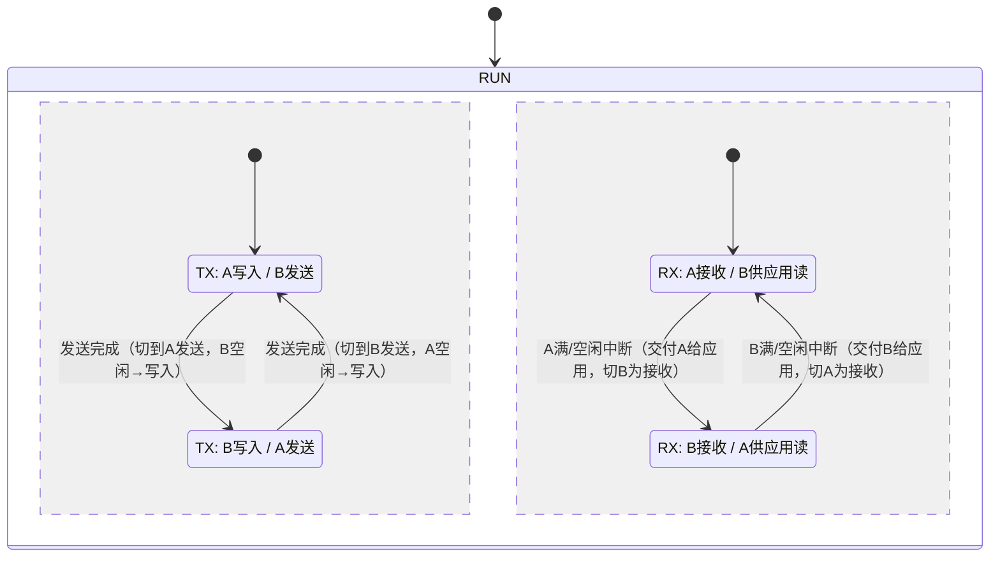

# 双缓冲区

基础 API 说明见 [DoubleBuffer（双缓冲区）](/docs/basic_coding/structure/double_buffer)。

这里讨论的不是数据结构接口，而是它在驱动里的作用。双缓冲的价值在于把硬件传输、下一块数据准备和上层提交这三件事错开：只要当前块还在总线上，驱动就可以准备下一块，完成中断到来时只做切换和续传，从而缩短空窗、稳定时序。

---

## 1. `DoubleBuffer` 的状态模型

`LibXR::DoubleBuffer` 把一段连续内存平分成两块，分别暴露为 `ActiveBuffer()` 和 `PendingBuffer()`。前者对应当前正在被硬件使用的缓冲区，后者对应下一块待切换的缓冲区。内部真正维护的状态并不多：当前 active block 编号、pending 是否有效，以及 active/pending 的有效长度。

这套结构本身并不关心 DMA、USB 还是 UART。它只表达一件事：当前这一块已经交给硬件，下一块是否已经准备好，什么时候允许切换。

---

## 2. 为什么驱动层需要双缓冲

如果只有一块缓冲区，发送路径通常只能串行：等当前传输结束，再写下一块数据，再启动下一次传输。双缓冲把这条链拆开之后，硬件可以继续发送 active block，CPU 同时把下一块写进 pending block；等发送完成 ISR 到来，驱动只做 `Switch()` 和续传，不必在中断里重新准备数据。对高频小包路径来说，这种差别往往直接决定吞吐和抖动。

---

## 3. 串口驱动里的双缓冲

`STM32UART` 和 `CH32UART` 的 TX 都直接建立在 `DoubleBuffer` 上。写路径的形状基本一致：如果 DMA 空闲，当前请求直接写进 active 区并立刻启动；如果 DMA 正忙，则写进 pending 区，记录长度并标记可切换，等待发送完成中断接手。中断里首先根据 `pending_len` 判断是否有下一块可发；只要有，就切换到新的 active block 并立即续上 DMA，之后再处理上一笔写操作的完成状态。这条顺序不能反过来。先续上总线，再做队列和状态更新，是串口高频路径里最关键的安排。

---

## 4. USB / SPI 里的双缓冲

在高速接口里，双缓冲更偏向“直接访问底层缓冲区”。

`USB::Endpoint` 的双缓冲语义和 UART 不完全一样。端点完成回调里看到的 `PendingBuffer()` 表示刚刚完成的那一包，而不是未来要发送的下一块。因此同样是 active/pending，USB 回调里读取的是“已完成的数据块”，UART 发送路径里准备的是“下一块待发送数据”。这两个语义不能混。

`SPI` 则通常在一次传输完成后同时切换 RX/TX 双缓冲，让下一轮数据准备和当前传输结束自然衔接。这里的重点不是接口抽象，而是尽量缩短两次传输之间的空窗。

---

## 5. 两类常见用法

这里大致有两类用法。第一类是驱动内部拷贝型，典型如 `STM32UART`、`CH32UART`、`ESP32UART` 和 `ESP32CDCJtag`：用户数据先进入队列，再由驱动拷进 active/pending buffer，硬件只看驱动内部的双缓冲。第二类是直接缓冲暴露型，典型如 USB Endpoint 和 SPI 零拷贝传输：上层可以直接接触底层缓冲区，驱动只负责 block 交接和状态推进。这两类路径使用的是同一个数据结构，但目标不同，前者重在统一和清晰，后者重在减少额外拷贝。

---

## 6. 基本原理图

以串口发送为例：

这个图里的关键点是：

- 应用写入和硬件发送并不是同一块 buffer
- 发送完成时只做 block 切换
- 下一块数据通常在前一块尚未发完时就已经准备好了

---

## 6. 什么时候适合用双缓冲

双缓冲最适合硬件传输和 CPU 准备数据可以并行、单次传输不大但连续不断、ISR 里需要尽快续上传输的场景。反过来说，如果接口本身很慢、负载很低，或者上层一次只偶尔发几个字节，双缓冲未必有明显收益，反而会徒增状态管理。
