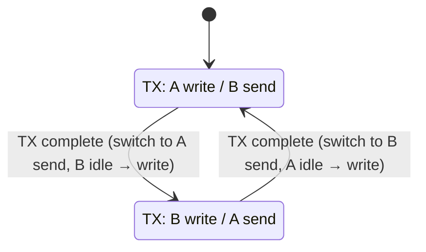

# Double Buffering

For the basic API, see [DoubleBuffer](/docs/basic_coding/structure/double_buffer).

This page describes the role of `DoubleBuffer` in drivers. Double buffering separates three things
in time: the hardware transfer, preparation of the next block, and submission from upper layers.
While the current block is still on the bus, the driver can prepare the next one, and the completion
interrupt only switches blocks and continues the transfer, which shortens gaps and keeps timing
stable.

---

## 1. The `DoubleBuffer` state model

`LibXR::DoubleBuffer` splits one contiguous memory region into two equal blocks, exposed as
`ActiveBuffer()` and `PendingBuffer()`. The first is the buffer the hardware is currently using; the
second is the next buffer waiting to be switched in. The internal state is small: the index of the
active block, whether the pending block is valid, and the valid lengths of the active and pending
blocks.

The structure itself does not depend on DMA, USB, or UART. It only records that the current block
has been handed to the hardware, whether the next block is ready, and when a switch is allowed.

---

## 2. Why drivers need double buffering

With a single buffer, the transmit path is usually serial: wait for the current transfer to finish,
write the next block, then start the next transfer. Double buffering breaks this chain: the hardware
keeps sending the active block while the CPU writes the next block into the pending block; when the
transmit-complete ISR arrives, the driver only calls `Switch()` and continues the transfer, without
preparing data inside the interrupt. On high-frequency small-packet paths, this difference often
determines throughput and jitter.

---

## 3. Double buffering in UART drivers

The transmit side of `STM32UART` and `CH32UART` is built on `DoubleBuffer`: when DMA is idle, a request is written into `ActiveBuffer()` and DMA starts immediately; when DMA is busy, the request is written into `PendingBuffer()` and its length is recorded; the transmit-complete interrupt checks with `HasPending()` that the pending block holds data, calls `Switch()` and starts the next DMA transfer. When a write request completes and the full transmit order are described in the "MCU path" section of [UART Driver Design](./uart_driver.md).

---

## 4. Double buffering in USB / SPI

On high-speed interfaces, double buffering leans toward direct access to the underlying buffers.

The double-buffer semantics of `USB::Endpoint` differ from UART. The `PendingBuffer()` seen in an
endpoint completion callback is the packet that has just completed, not the next block to be sent.
So although both use active/pending, a USB callback reads a completed block, while the UART transmit
path prepares the next block to send. The two meanings must not be confused.

`SPI` usually switches the RX/TX double buffers together after a transfer completes, so that
preparation of the next round follows directly from the end of the current transfer. The focus here
is on keeping the gap between two transfers as short as possible rather than on the interface
abstraction.

---

## 5. Two common usage patterns

There are roughly two usage patterns. The first is driver-internal copying, typically `STM32UART`,
`CH32UART`, and the GDMA path of `ESP32UART`: user data first enters a queue, the driver then copies
it into the active/pending buffer, and the hardware only sees the driver's internal double buffer.
The second is direct buffer exposure, typically USB Endpoint and SPI zero-copy transfers: upper
layers access the underlying buffers directly, and the driver only handles block handoff and state
progression. Both patterns use the same data structure with different goals: the first favors
uniformity and clarity, the second avoids extra copies.

---

## 6. Basic diagram

Taking UART transmit as an example:

UART receive uses one circular DMA buffer and does not go through `DoubleBuffer`.

Key points in this diagram:

- application writes and hardware transmission use different buffers
- transmit completion only switches blocks
- the next block is usually ready before the previous one has finished sending

---

## 7. When double buffering fits

Double buffering fits best when hardware transfer and CPU data preparation can run in parallel,
individual transfers are small but continuous, and the ISR needs to continue the transfer quickly.
Conversely, if the interface is slow, the load is low, or upper layers only occasionally send a few
bytes, double buffering may bring no noticeable benefit and only adds state management.
